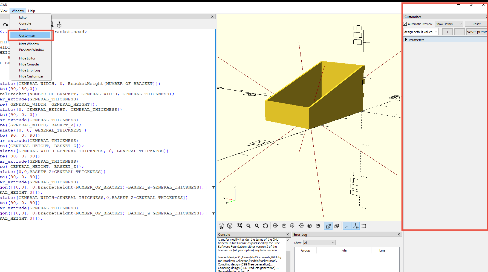
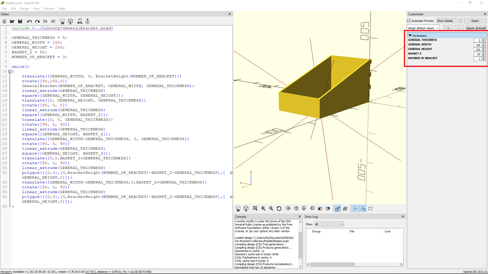
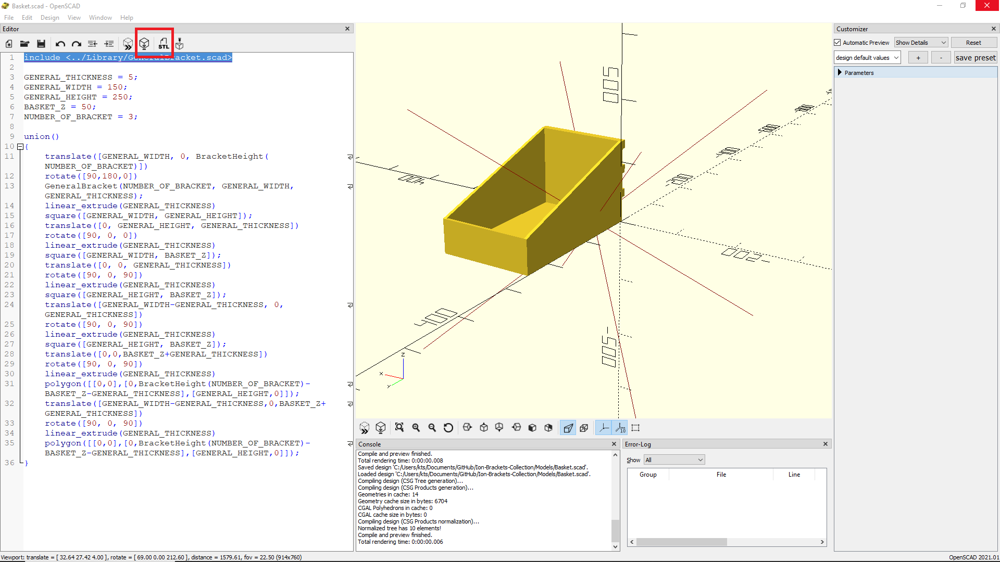
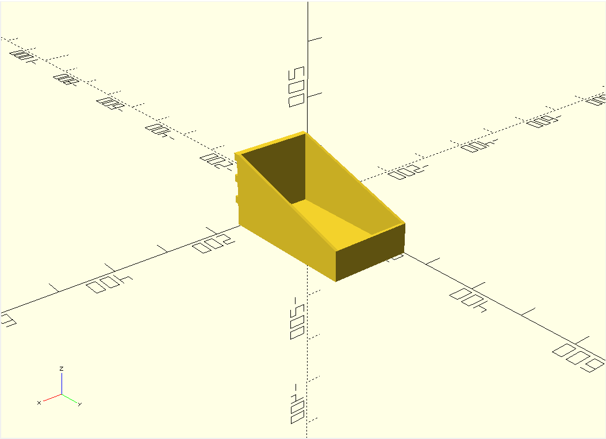
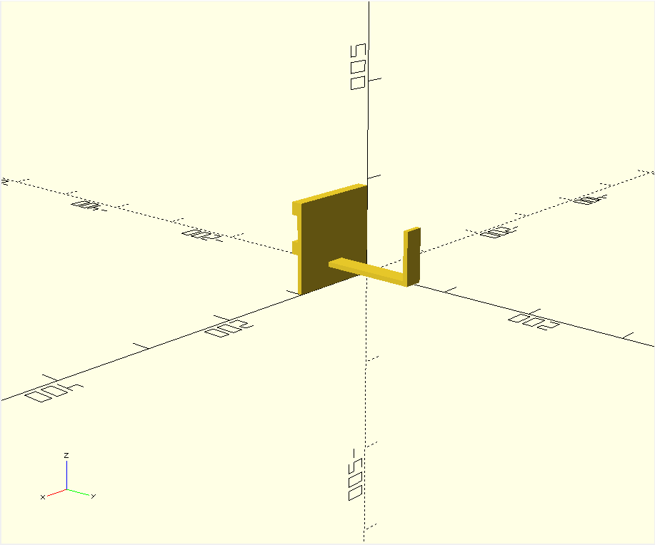
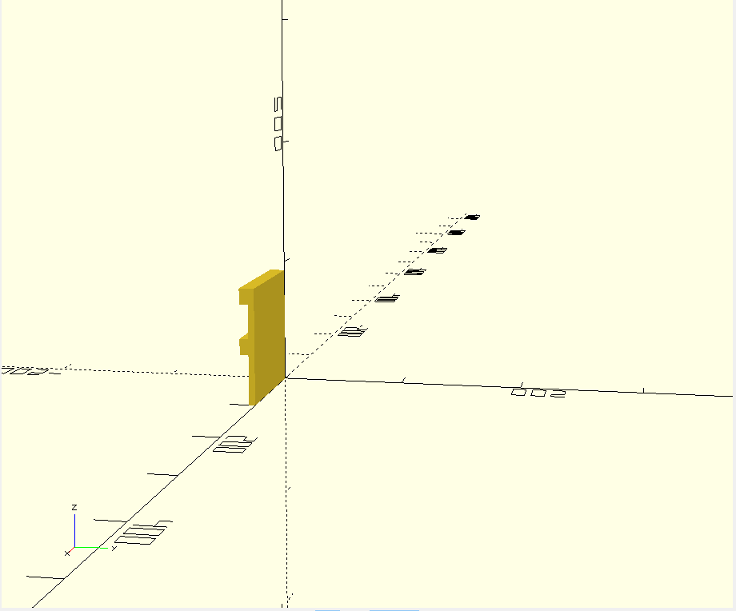

# Ion-Brackets-Collection
Collection of openscad CAD to customize your own ION-Brackets objects

## How To Use
1. Download the openscad project: https://openscad.org/downloads.html
2. Open the desired Model you want to customize/print.
3. Enable the customizer view on Openscad:

4. Modify the parameters to your liking (generally in mm):

5. Render the object and generate the STL:

6. Use the generated STL to print!

## Current Models
### Basket

### Hooks

### IonBrackets

