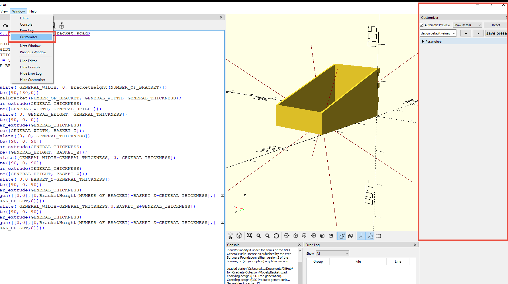
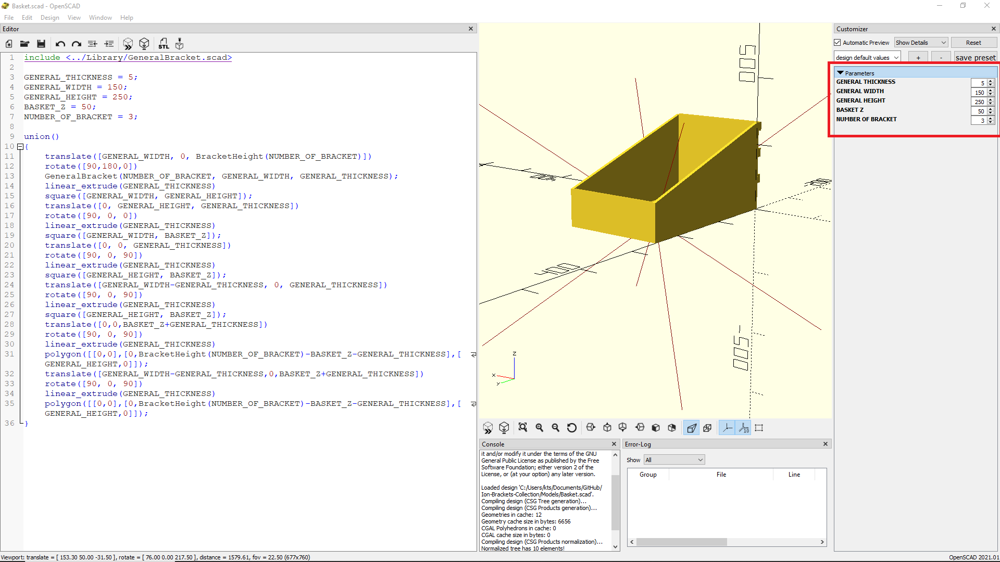
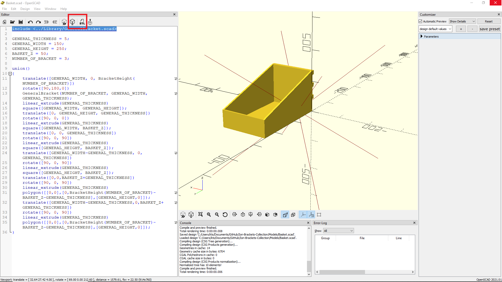
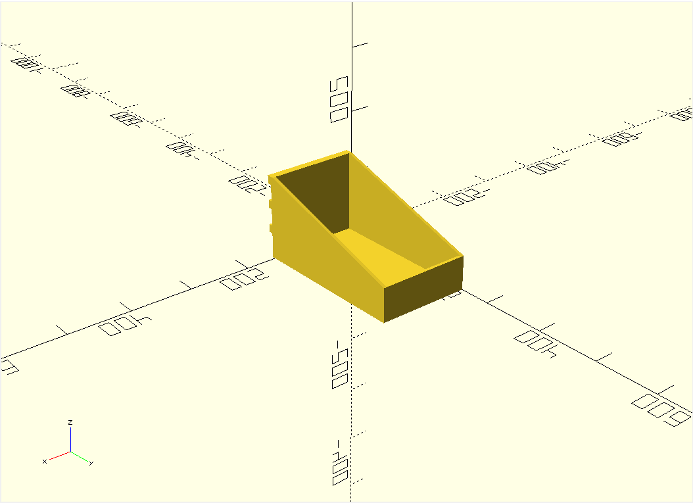
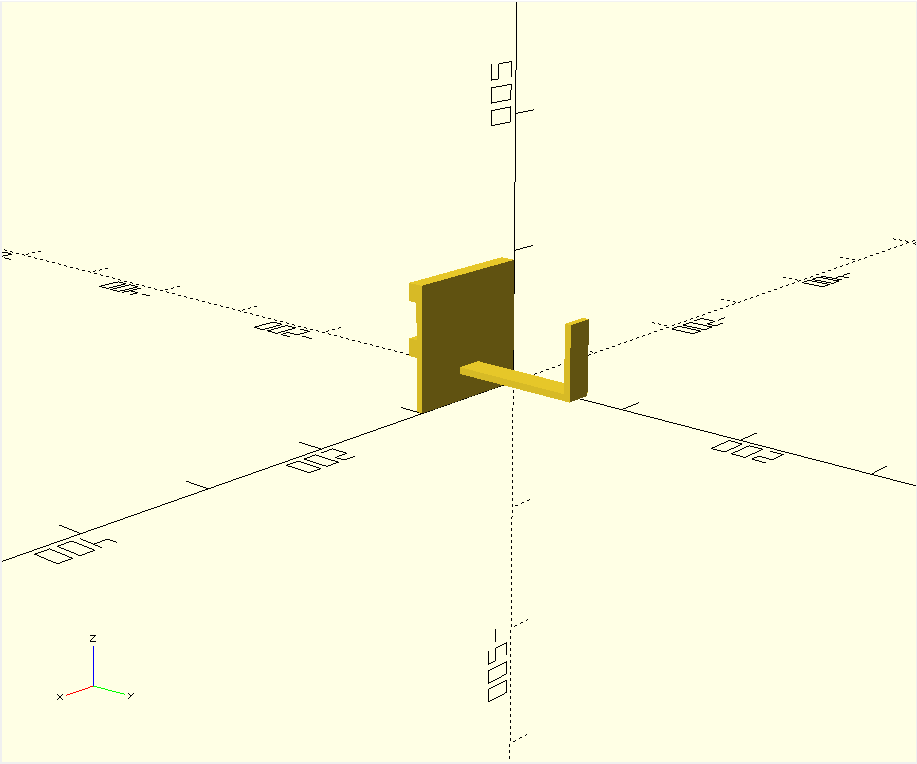
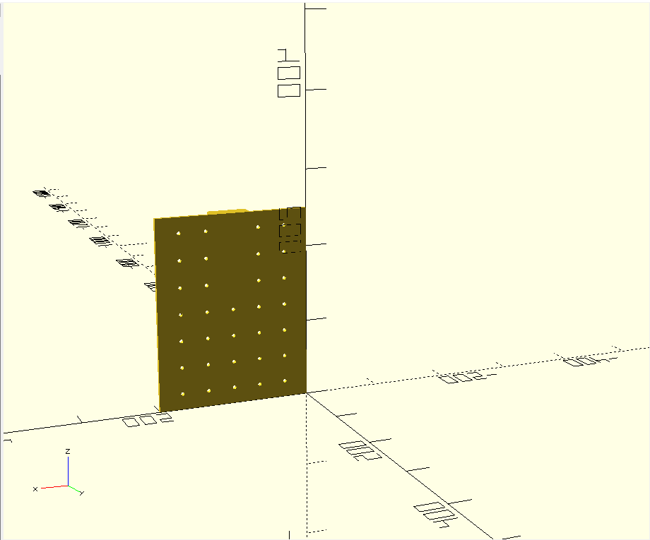
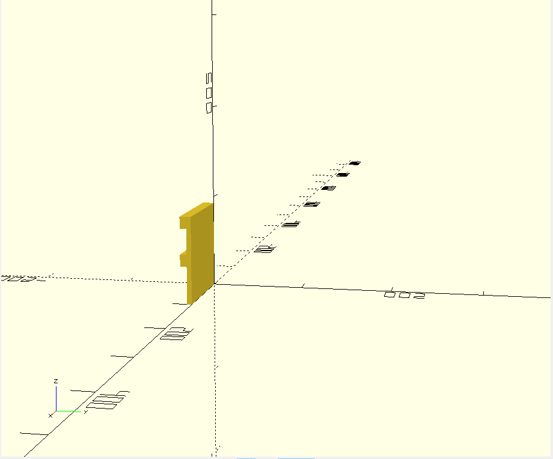

# Ion-Brackets-Collection
Collection of openscad CAD to customize your own ION-Brackets objects

## How To Use
1. Download the openscad project: https://openscad.org/downloads.html
2. Open the desired Model you want to customize/print.
3. Enable the customizer view on Openscad:

4. Modify the parameters to your liking (generally in mm):

5. Render the object and generate the STL:

6. Use the generated STL to print!

### Threaded HoneyCombIonHook

`Models/HoneyCombIonHook.scad` uses `threadlib/threadlib.scad` to create a
standard M8 internal thread through the rear face of the back ledge.
`Models/Knob.scad` creates the
matching M8 external thread.

The required threadlib files are included under `Library/threadlib/`, along
with its thread-profile and OpenSCAD utility dependencies. Open the project
from its repository folder so OpenSCAD can resolve the local library paths.

## Current Models
### Basket

### Hooks

### PegBoard

### IonBrackets

